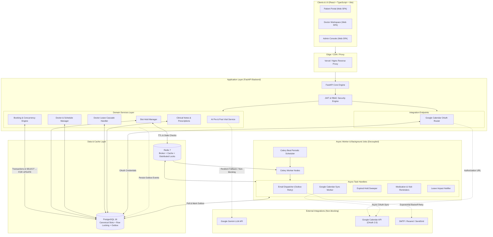

# Healthcare Appointment & Follow-up Manager — System Architecture

## 1. System Overview

The **Healthcare Appointment & Follow-up Manager** is an enterprise-grade full-stack healthcare coordination system supporting three distinct roles: **Patients**, **Doctors**, and **Administrators**.

The platform is designed with resilience, high concurrency, and production deployment in mind (supporting cloud environments such as Render, Railway, Vercel, AWS, or managed Kubernetes).

---

## 2. High-Level Architecture Diagram

---

## 3. Core Architectural Pillars

### 3.1. Double-Booking Prevention & Canonical Slot Locking
Race conditions during appointment bookings can lead to double-booked doctors. To guarantee strict isolation:
1. **Canonical `appointment_slots` Resource**:
   - The `appointment_slots` table is the persisted, authoritative single source of truth for all slot state and locking.
   - Unique database constraint on `(doctor_id, slot_date, start_time)` eliminates duplicate slot definitions.
2. **Pessimistic Row-Level Locking (`SELECT ... FOR UPDATE`)**:
   - When initiating a slot hold or booking, the transaction locks the canonical `appointment_slots` record using `SELECT * FROM appointment_slots WHERE id = :slot_id FOR UPDATE;`.
   - Simultaneous transactions serialize strictly around that specific slot row.
3. **Partial Unique Indexes for Active Bookings**:
   - `uq_appointments_active_slot` on `appointments(slot_id) WHERE status IN ('held', 'confirmed')` prevents two active appointments for one slot while allowing cancelled/rescheduled appointment history.
   - `uq_slot_holds_active_slot` on `slot_holds(slot_id) WHERE status = 'active'` prevents two simultaneous active holds on the same slot at the database level.
4. **IntegrityError Safety**:
   - `BookingService.hold_slot` wraps the commit in a `try/except IntegrityError` block, catching partial unique index violations and returning `HTTP 409 Conflict` immediately.

### 3.2. Temporary Slot Hold Mechanism
- When a patient selects a slot to fill in symptoms and review details, a temporary hold (configurable via `SLOT_HOLD_DURATION_MINUTES`, default 10 minutes) is created.
- The `slot_holds` table tracks `slot_id`, `patient_id`, `expires_at`, and `status` (`ACTIVE`, `EXPIRED`, `RELEASED`, `CONVERTED`).
- **In-Transaction Expiry Check**: The booking transaction directly evaluates `expires_at` during the locked transaction. Expired holds never block other patients from booking, even before Celery cleanup runs.
- **Background Sweeper**: Celery Beat runs a periodic cleanup job to release expired holds in bulk.

### 3.3. Doctor Leave Cascade Management
When an administrator marks a doctor as unavailable:
1. **Atomic Database Transaction**:
   - Updates `doctor_leave` table.
   - Sets affected `appointment_slots` status to `unavailable`.
   - Transitions existing affected appointments to `RESCHEDULED_REQUIRED` (preserves clinical and audit history; never deletes records).
   - Inserts `LEAVE_APPLIED` event into `outbox_events`.
2. **Asynchronous Notification & Calendar Cascade**:
   - Celery worker consumes the outbox event.
   - Dispatches notifications/emails to affected patients.
   - Cancels or shifts linked Google Calendar events asynchronously.

### 3.4. AI Resiliency & Graceful Degradation
- **Pre-Visit Symptom Summary**:
  - Extracts Urgency (Low/Medium/High), Chief Complaint, and 3 Suggested Questions for the doctor.
  - Strict guardrails: **AI does NOT provide a diagnosis**.
- **Post-Visit Summary**:
  - Translates doctor's clinical notes into a patient-friendly summary with a clear medication schedule and follow-up steps.
  - Requires doctor review/approval before patient visibility (**publish gate**).
- **Fault-Tolerance Architecture**:
  - LLM calls are wrapped with timeouts (e.g., 5-8 seconds), retry limits, and fallback defaults.
  - If the LLM service is unavailable, quota-exceeded, or errors out, the core booking/clinical note saving continues successfully. A deterministic fallback provides structured output with 3 generic clarification questions.

### 3.5. Transactional Outbox Pattern & Background Jobs
- **Transactional Outbox**:
  - Within the same ACID transaction that updates an appointment, an `outbox_events` row is created.
  - Guarantees zero lost side-effects even if server crashes post-commit.
- **Decoupled Celery Workers**:
  - Heavy tasks (email dispatch, Google Calendar API calls, automated reminders) are processed asynchronously.
  - **Worker Independence**: The core API, DB connectivity, authentication, and booking transactions operate fully even if Celery/Redis workers are temporarily offline.
  - Exponential backoff retries (e.g., 1m, 5m, 15m, 1h) ensure eventual delivery.

### 3.6. Google Calendar Integration (Non-Blocking)
- **OAuth 2.0 Authorization Flow**: Doctors connect their Google Calendar through dedicated integration endpoints (`/api/v1/integrations/google/connect`, `/callback`, `/status`, `/disconnect`).
- **Credential Storage**: `DoctorCalendarCredential` model stores encrypted access tokens, refresh tokens, and connection status per doctor.
- **Event Synchronization**: `GoogleCalendarSync` model tracks per-appointment sync state (pending, synced, failed, cancelled) with `google_event_id` for update/delete operations.
- **Non-Blocking Guarantee**: Calendar operations are dispatched via Celery outbox workers. Calendar failures **never** cause appointment booking to fail.

### 3.7. Transactional Email Service
- **Asynchronous Email Dispatch**: All emails (booking confirmations, cancellation notices, doctor leave rescheduling alerts) are sent via the Celery outbox worker pipeline.
- **Fault Tolerance**: `EmailService` guarantees that SMTP failures never raise exceptions to the caller or rollback business transactions.
- **Template System**: Pre-built HTML email templates for confirmation, cancellation, and leave impact notifications.

---

## 4. Technology Stack Justification

| Layer | Technology | Rationale |
|---|---|---|
| **Frontend** | React 18 + TypeScript + Vite | Type-safety, fast build performance, modern component-driven SPA. |
| **Styling** | Tailwind CSS v3 | Utility-first, responsive design, zero runtime overhead. |
| **Routing** | React Router v6 | Declarative role-based routing (Patient/Doctor/Admin). |
| **Backend API** | Python 3.12+ / FastAPI | High-performance async ASGI, native OpenAPI docs, Pydantic validation. |
| **ORM & Migrations** | SQLAlchemy 2.0 (AsyncPG) + Alembic | Modern async ORM with robust migration tracking; pure async stack without `psycopg2-binary`. |
| **Database** | PostgreSQL 16 | ACID compliance, `btree_gist` exclusion constraints, row-level locking, partial unique indexes. |
| **Cache / Broker** | Redis 7 | In-memory key-value cache, lock coordination, Celery task queue broker. |
| **Worker Queue** | Celery + Celery Beat | Battle-tested Python background job framework with periodic scheduling. |
| **Auth** | JWT + bcrypt + RBAC | Stateless secure authentication with token expiration and role enforcement. |
| **AI/LLM** | Google Gemini API | Pre/post-visit summary generation with structured fallback. |
| **Calendar** | Google Calendar API (OAuth 2.0) | Appointment synchronization with doctor calendars. |
| **Email** | SMTP (SendGrid / Resend) | Transactional appointment lifecycle emails. |

---

## 5. Deployment Topology

The application is structured for 12-factor cloud deployment:
- **Frontend**: Deployable as static assets on **Vercel**, **Netlify**, or **Cloudflare Pages**.
- **Backend API**: Deployable on **Render**, **Railway**, **Fly.io**, or **AWS ECS/App Runner**.
- **Background Worker**: Dedicated container process running `celery -A app.jobs.celery_app.celery_app worker --loglevel=info`.
- **Periodic Scheduler**: Celery Beat container running `celery -A app.jobs.celery_app.celery_app beat`.
- **Database & Cache**: Managed PostgreSQL (Supabase, Neon, AWS RDS) and Managed Redis (Upstash, Redis Cloud).
- **Zero Hardcoded Secrets**: All configuration is managed via environment variables.

---

## 6. API Router Registry

| Prefix | Router Module | Description |
|---|---|---|
| `/api/health` | `health.py` | System health & connectivity diagnostics |
| `/api/v1/auth` | `auth.py` | Registration, login, JWT, RBAC |
| `/api/v1/doctors` | `doctors.py` | Doctor profiles, specializations, slots |
| `/api/v1/admin` | `admin.py` | Doctor onboarding, leave management |
| `/api/v1/appointments` | `appointments.py` | Hold, confirm, cancel, complete |
| `/api/v1/clinical` | `clinical.py` | Clinical notes, prescriptions |
| `/api/v1/engagement` | `engagement.py` | AI summaries, notifications, reminders |
| `/api/v1/integrations/google` | `integrations.py` | Google Calendar OAuth connect/callback/status/disconnect |
