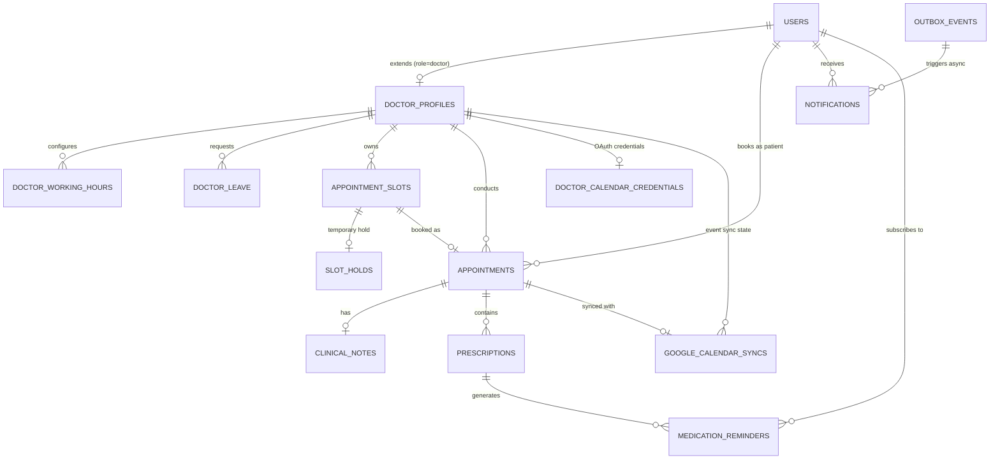

# Healthcare Appointment & Follow-up Manager — Database Design

## 1. Relational Schema Overview

The database is built on **PostgreSQL 16** with the `btree_gist` extension enabled for timestamp range exclusion constraints and strict serialized row locking.



---

## 2. Table Specifications & DDL Definitions

### 2.1. `users`
Core user identity supporting Patients, Doctors, and Admins.

| Column | Type | Constraints | Description |
|---|---|---|---|
| `id` | `UUID` | `PRIMARY KEY, DEFAULT gen_random_uuid()` | Unique user identifier |
| `name` | `VARCHAR(200)` | `NOT NULL` | Full display name |
| `email` | `VARCHAR(255)` | `UNIQUE, NOT NULL` | Login email address |
| `password_hash` | `VARCHAR(255)` | `NOT NULL` | bcrypt-hashed password |
| `role` | `VARCHAR(20)` | `NOT NULL, CHECK (role IN ('patient', 'doctor', 'admin'))` | User permission role |
| `phone` | `VARCHAR(20)` | `NULL` | Optional contact phone number |
| `is_active` | `BOOLEAN` | `DEFAULT TRUE, NOT NULL` | Account status flag |
| `created_at` | `TIMESTAMPTZ` | `DEFAULT NOW(), NOT NULL` | Timestamp created |
| `updated_at` | `TIMESTAMPTZ` | `DEFAULT NOW(), NOT NULL` | Timestamp last updated |

**Indexes:**
- `idx_users_email` ON `users(email)`
- `idx_users_role` ON `users(role)`

---

### 2.2. `doctor_profiles`
Specialized attributes for doctor users.

| Column | Type | Constraints | Description |
|---|---|---|---|
| `id` | `UUID` | `PRIMARY KEY, DEFAULT gen_random_uuid()` | Profile ID |
| `user_id` | `UUID` | `UNIQUE, NOT NULL, REFERENCES users(id) ON DELETE CASCADE` | Associated user ID |
| `specialization` | `VARCHAR(100)` | `NOT NULL` | Medical field (e.g. Cardiology, Pediatrics) |
| `bio` | `TEXT` | `NULL` | Professional background & qualifications |
| `slot_duration_minutes`| `INTEGER` | `DEFAULT 30, NOT NULL, CHECK (slot_duration_minutes > 0)` | Standard appointment slot length |
| `consultation_fee` | `NUMERIC(10, 2)`| `DEFAULT 0.00, NOT NULL` | Fee per consultation |
| `created_at` | `TIMESTAMPTZ` | `DEFAULT NOW(), NOT NULL` | Record creation timestamp |
| `updated_at` | `TIMESTAMPTZ` | `DEFAULT NOW(), NOT NULL` | Record update timestamp |

**Indexes:**
- `idx_doctor_profiles_specialization` ON `doctor_profiles(specialization)`

---

### 2.3. `doctor_working_hours`
Configures weekly recurring shift availability per doctor.

| Column | Type | Constraints | Description |
|---|---|---|---|
| `id` | `UUID` | `PRIMARY KEY, DEFAULT gen_random_uuid()` | Working hours ID |
| `doctor_id` | `UUID` | `NOT NULL, REFERENCES doctor_profiles(id) ON DELETE CASCADE` | Associated doctor profile |
| `day_of_week` | `INTEGER` | `NOT NULL, CHECK (day_of_week BETWEEN 0 AND 6)` | 0=Sunday, 1=Monday ... 6=Saturday |
| `start_time` | `TIME` | `NOT NULL` | Daily shift start (e.g. 09:00:00) |
| `end_time` | `TIME` | `NOT NULL, CHECK (end_time > start_time)` | Daily shift end (e.g. 17:00:00) |
| `created_at` | `TIMESTAMPTZ` | `DEFAULT NOW(), NOT NULL` | Created at |
| `updated_at` | `TIMESTAMPTZ` | `DEFAULT NOW(), NOT NULL` | Updated at |

**Constraints & Indexes:**
- `UNIQUE(doctor_id, day_of_week, start_time)`
- `idx_doctor_working_hours_lookup` ON `doctor_working_hours(doctor_id, day_of_week)`

---

### 2.4. `doctor_leave`
Tracks planned doctor absences, vacations, and emergency leave.

| Column | Type | Constraints | Description |
|---|---|---|---|
| `id` | `UUID` | `PRIMARY KEY, DEFAULT gen_random_uuid()` | Leave record ID |
| `doctor_id` | `UUID` | `NOT NULL, REFERENCES doctor_profiles(id) ON DELETE CASCADE` | Associated doctor profile |
| `leave_date` | `DATE` | `NOT NULL` | Specific leave date or start date |
| `end_date` | `DATE` | `NULL, CHECK (end_date >= leave_date)` | Optional multi-day end date |
| `reason` | `VARCHAR(255)` | `NULL` | Reason for absence |
| `status` | `VARCHAR(20)` | `DEFAULT 'approved', NOT NULL, CHECK (status IN ('pending', 'approved', 'cancelled'))` | Leave state |
| `created_at` | `TIMESTAMPTZ` | `DEFAULT NOW(), NOT NULL` | Created at |
| `updated_at` | `TIMESTAMPTZ` | `DEFAULT NOW(), NOT NULL` | Updated at |

**Indexes:**
- `idx_doctor_leave_dates` ON `doctor_leave(doctor_id, leave_date, end_date)`

---

### 2.5. `appointment_slots` (Canonical Slot Resource)
The canonical slot table serving as the single source of truth for booking concurrency and locking.

| Column | Type | Constraints | Description |
|---|---|---|---|
| `id` | `UUID` | `PRIMARY KEY, DEFAULT gen_random_uuid()` | Slot ID |
| `doctor_id` | `UUID` | `NOT NULL, REFERENCES doctor_profiles(id) ON DELETE CASCADE` | Doctor profile ID |
| `slot_date` | `DATE` | `NOT NULL` | Calendar date of slot |
| `start_time` | `TIMESTAMPTZ` | `NOT NULL` | Precise start timestamp (UTC) |
| `end_time` | `TIMESTAMPTZ` | `NOT NULL, CHECK (end_time > start_time)` | Precise end timestamp (UTC) |
| `status` | `VARCHAR(20)` | `DEFAULT 'available', NOT NULL, CHECK (status IN ('available', 'held', 'booked', 'unavailable'))` | Current slot availability |
| `created_at` | `TIMESTAMPTZ` | `DEFAULT NOW(), NOT NULL` | Created at |
| `updated_at` | `TIMESTAMPTZ` | `DEFAULT NOW(), NOT NULL` | Updated at |

**Constraints & Indexes:**
- `UNIQUE(doctor_id, slot_date, start_time)` (Prevents duplicate slots for same doctor & time)
- `idx_appointment_slots_doctor_date` ON `appointment_slots(doctor_id, slot_date, status)`

---

### 2.6. `slot_holds` (Temporary Slot Holds)
Manages temporary reservation windows during patient symptom intake and confirmation.

| Column | Type | Constraints | Description |
|---|---|---|---|
| `id` | `UUID` | `PRIMARY KEY, DEFAULT gen_random_uuid()` | Hold record ID |
| `slot_id` | `UUID` | `NOT NULL, REFERENCES appointment_slots(id) ON DELETE CASCADE` | Canonical slot held |
| `patient_id` | `UUID` | `NOT NULL, REFERENCES users(id) ON DELETE CASCADE` | Reserving patient |
| `status` | `VARCHAR(20)` | `DEFAULT 'ACTIVE', NOT NULL, CHECK (status IN ('ACTIVE', 'EXPIRED', 'RELEASED', 'CONVERTED'))` | Hold state |
| `expires_at` | `TIMESTAMPTZ` | `NOT NULL` | Expiration timestamp (e.g. created_at + 10 mins) |
| `created_at` | `TIMESTAMPTZ` | `DEFAULT NOW(), NOT NULL` | Created at |
| `updated_at` | `TIMESTAMPTZ` | `DEFAULT NOW(), NOT NULL` | Updated at |

**Indexes & Constraints:**
- `idx_slot_holds_active` ON `slot_holds(slot_id, expires_at) WHERE status = 'ACTIVE'`
- `uq_slot_holds_active_slot` UNIQUE ON `slot_holds(slot_id) WHERE status = 'active'` — prevents double-hold at DB level

---

### 2.7. `appointments`
Core confirmed appointment entity with symptoms, AI summaries, and concurrency exclusion guards.

| Column | Type | Constraints | Description |
|---|---|---|---|
| `id` | `UUID` | `PRIMARY KEY, DEFAULT gen_random_uuid()` | Appointment ID |
| `slot_id` | `UUID` | `NOT NULL, REFERENCES appointment_slots(id) ON DELETE RESTRICT` | Associated canonical slot |
| `patient_id` | `UUID` | `NOT NULL, REFERENCES users(id) ON DELETE RESTRICT` | Patient user ID |
| `doctor_id` | `UUID` | `NOT NULL, REFERENCES doctor_profiles(id) ON DELETE RESTRICT` | Attending doctor profile ID |
| `status` | `VARCHAR(30)` | `NOT NULL, CHECK (...)` | Lifecycle status |
| `symptoms` | `TEXT` | `NULL` | Patient-submitted symptoms |
| `pre_visit_summary` | `TEXT` | `NULL` | AI-generated pre-visit briefing |
| `urgency_level` | `VARCHAR(20)` | `NULL` | AI triage urgency category |
| `created_at` | `TIMESTAMPTZ` | `DEFAULT NOW(), NOT NULL` | Created at |
| `updated_at` | `TIMESTAMPTZ` | `DEFAULT NOW(), NOT NULL` | Updated at |

**Concurrency Constraints & Indexes:**
- `uq_appointments_active_slot` UNIQUE ON `appointments(slot_id) WHERE status IN ('held', 'confirmed')` — partial unique index allowing cancelled appointment history
- `idx_appointments_patient` ON `appointments(patient_id, created_at DESC)`
- `idx_appointments_doctor` ON `appointments(doctor_id, created_at DESC)`

---

### 2.8. `clinical_notes`
Doctor notes recorded post-visit with AI patient-friendly draft and doctor approval flag.

| Column | Type | Constraints | Description |
|---|---|---|---|
| `id` | `UUID` | `PRIMARY KEY, DEFAULT gen_random_uuid()` | Note ID |
| `appointment_id` | `UUID` | `UNIQUE, NOT NULL, REFERENCES appointments(id) ON DELETE CASCADE` | Associated appointment |
| `doctor_id` | `UUID` | `NOT NULL, REFERENCES doctor_profiles(id)` | Attending doctor |
| `notes` | `TEXT` | `NOT NULL` | Professional clinical diagnosis & observations |
| `follow_up_instructions`| `TEXT` | `NULL` | Recommended patient instructions & next steps |
| `ai_patient_summary` | `TEXT` | `NULL` | Plain-English AI translation of clinical notes |
| `ai_summary_approved` | `BOOLEAN` | `DEFAULT FALSE, NOT NULL` | Doctor review gate before patient display |
| `created_at` | `TIMESTAMPTZ` | `DEFAULT NOW(), NOT NULL` | Created at |
| `updated_at` | `TIMESTAMPTZ` | `DEFAULT NOW(), NOT NULL` | Updated at |

---

### 2.9. `prescriptions`
Structured medication entries tied to appointment clinical notes.

| Column | Type | Constraints | Description |
|---|---|---|---|
| `id` | `UUID` | `PRIMARY KEY, DEFAULT gen_random_uuid()` | Prescription ID |
| `appointment_id` | `UUID` | `NOT NULL, REFERENCES appointments(id) ON DELETE CASCADE` | Associated appointment |
| `doctor_id` | `UUID` | `NOT NULL, REFERENCES doctor_profiles(id)` | Prescribing doctor |
| `medication_name` | `VARCHAR(200)` | `NOT NULL` | Medication name & strength |
| `dosage` | `VARCHAR(100)` | `NOT NULL` | Dosage quantity |
| `frequency` | `VARCHAR(100)` | `NOT NULL` | Frequency (e.g. Twice daily after meals) |
| `duration` | `VARCHAR(100)` | `NOT NULL` | Total duration course |
| `instructions` | `TEXT` | `NULL` | Special administration instructions |
| `created_at` | `TIMESTAMPTZ` | `DEFAULT NOW(), NOT NULL` | Created at |
| `updated_at` | `TIMESTAMPTZ` | `DEFAULT NOW(), NOT NULL` | Updated at |

---

### 2.10. `medication_reminders`
Patient reminder configuration and execution schedule.

| Column | Type | Constraints | Description |
|---|---|---|---|
| `id` | `UUID` | `PRIMARY KEY, DEFAULT gen_random_uuid()` | Reminder ID |
| `prescription_id` | `UUID` | `NULL, REFERENCES prescriptions(id) ON DELETE CASCADE` | Linked prescription |
| `patient_id` | `UUID` | `NOT NULL, REFERENCES users(id) ON DELETE CASCADE` | Patient user |
| `scheduled_time` | `TIME` | `NOT NULL` | Daily alarm time |
| `frequency` | `VARCHAR(100)` | `NOT NULL` | Frequency description |
| `next_reminder_at` | `TIMESTAMPTZ` | `NOT NULL` | Next trigger timestamp |
| `status` | `VARCHAR(20)` | `DEFAULT 'ACTIVE', NOT NULL` | Status |
| `created_at` | `TIMESTAMPTZ` | `DEFAULT NOW(), NOT NULL` | Created at |
| `updated_at` | `TIMESTAMPTZ` | `DEFAULT NOW(), NOT NULL` | Updated at |

---

### 2.11. `doctor_calendar_credentials`
Stores Google OAuth 2.0 credentials for synchronized doctor calendars.

| Column | Type | Constraints | Description |
|---|---|---|---|
| `id` | `UUID` | `PRIMARY KEY, DEFAULT gen_random_uuid()` | Credential record ID |
| `doctor_id` | `UUID` | `UNIQUE, NOT NULL, REFERENCES doctor_profiles(id) ON DELETE CASCADE` | Associated doctor profile |
| `access_token` | `TEXT` | `NOT NULL` | Google OAuth access token |
| `refresh_token` | `TEXT` | `NOT NULL` | Google OAuth refresh token |
| `token_expiry` | `TIMESTAMPTZ` | `NULL` | Token expiration timestamp |
| `calendar_id` | `VARCHAR(255)` | `DEFAULT 'primary', NOT NULL` | Target Google Calendar ID |
| `is_connected` | `BOOLEAN` | `DEFAULT TRUE, NOT NULL` | Active connection flag |
| `created_at` | `TIMESTAMPTZ` | `DEFAULT NOW(), NOT NULL` | Created at |
| `updated_at` | `TIMESTAMPTZ` | `DEFAULT NOW(), NOT NULL` | Updated at |

---

### 2.12. `google_calendar_syncs`
Tracks per-appointment synchronization state with Google Calendar API.

| Column | Type | Constraints | Description |
|---|---|---|---|
| `id` | `UUID` | `PRIMARY KEY, DEFAULT gen_random_uuid()` | Sync record ID |
| `appointment_id` | `UUID` | `UNIQUE, NOT NULL, REFERENCES appointments(id) ON DELETE CASCADE` | Synced appointment |
| `doctor_id` | `UUID` | `NOT NULL, REFERENCES doctor_profiles(id) ON DELETE CASCADE` | Associated doctor |
| `google_event_id` | `VARCHAR(255)` | `NULL, INDEX` | Google Calendar API Event ID |
| `calendar_id` | `VARCHAR(255)` | `DEFAULT 'primary', NOT NULL` | Target calendar |
| `sync_status` | `VARCHAR(30)` | `DEFAULT 'pending', NOT NULL, CHECK (sync_status IN ('pending', 'synced', 'failed', 'cancelled'))` | Sync state |
| `last_synced_at` | `TIMESTAMPTZ` | `NULL` | Last successful/attempted sync |
| `error_message` | `TEXT` | `NULL` | Sync error details |
| `created_at` | `TIMESTAMPTZ` | `DEFAULT NOW(), NOT NULL` | Created at |
| `updated_at` | `TIMESTAMPTZ` | `DEFAULT NOW(), NOT NULL` | Updated at |

---

### 2.13. `notifications`
In-app and email notification log with delivery tracking.

| Column | Type | Constraints | Description |
|---|---|---|---|
| `id` | `UUID` | `PRIMARY KEY, DEFAULT gen_random_uuid()` | Notification ID |
| `user_id` | `UUID` | `NOT NULL, REFERENCES users(id) ON DELETE CASCADE` | Recipient user |
| `appointment_id` | `UUID` | `NULL, REFERENCES appointments(id) ON DELETE SET NULL` | Linked appointment |
| `type` | `VARCHAR(50)` | `NOT NULL` | Notification type |
| `status` | `VARCHAR(20)` | `DEFAULT 'pending', NOT NULL` | Dispatch state |
| `retry_count` | `INTEGER` | `DEFAULT 0, NOT NULL` | Retry attempt count |
| `last_error` | `TEXT` | `NULL` | Error details |
| `scheduled_at` | `TIMESTAMPTZ` | `DEFAULT NOW(), NOT NULL` | Scheduled delivery timestamp |
| `sent_at` | `TIMESTAMPTZ` | `NULL` | Actual sent timestamp |
| `created_at` | `TIMESTAMPTZ` | `DEFAULT NOW(), NOT NULL` | Created at |
| `updated_at` | `TIMESTAMPTZ` | `DEFAULT NOW(), NOT NULL` | Updated at |

**Indexes:**
- `idx_notifications_scheduled` ON `notifications(scheduled_at) WHERE status IN ('pending', 'failed')`

---

### 2.14. `outbox_events` (Transactional Outbox)
Guarantees reliable asynchronous side-effect processing (Celery dispatch) without distributed transaction anomalies.

| Column | Type | Constraints | Description |
|---|---|---|---|
| `id` | `UUID` | `PRIMARY KEY, DEFAULT gen_random_uuid()` | Event ID |
| `aggregate_type` | `VARCHAR(100)` | `NOT NULL` | Aggregate entity |
| `aggregate_id` | `UUID` | `NOT NULL` | Aggregate entity ID |
| `event_type` | `VARCHAR(100)` | `NOT NULL` | Event name |
| `payload` | `JSONB` | `DEFAULT '{}'::jsonb, NOT NULL` | Serialized event payload |
| `status` | `VARCHAR(20)` | `DEFAULT 'pending', NOT NULL` | Outbox status |
| `retry_count` | `INTEGER` | `DEFAULT 0, NOT NULL` | Worker retry attempts |
| `last_error` | `TEXT` | `NULL` | Error details |
| `created_at` | `TIMESTAMPTZ` | `DEFAULT NOW(), NOT NULL` | Created at |
| `processed_at` | `TIMESTAMPTZ` | `NULL` | Timestamp processed by Celery |

**Indexes:**
- `idx_outbox_events_pending` ON `outbox_events(created_at) WHERE status IN ('pending', 'failed')`

---

## 3. Alembic Migration Chain

| Migration | Revision | Description |
|---|---|---|
| `20260823_01` | Initial schema | Users, doctor profiles, working hours, doctor leave, appointment slots, slot holds, appointments, clinical notes, prescriptions, medication reminders, notifications, outbox events |
| `20260823_02` | Slot holds & active booking constraint | `uq_appointments_active_slot` partial unique index, `uq_slot_holds_active_slot` partial unique index |
| `20260823_03` | Held by fields | `held_by_user_id` and `held_until` on `appointment_slots` |
| `20260823_04` | Chief complaint | `chief_complaint` column on `appointments` |
| `20260823_05` | Post-visit summaries | `post_visit_summaries` table with doctor publish gate |
| `20260824_06` | Google Calendar | `doctor_calendar_credentials` and `google_calendar_syncs` tables |

---

## 4. Concurrency Protection & Booking Protocol

```
+-------------------------------------------------------------+
|               TRANSACTIONAL BOOKING FLOW                    |
+-------------------------------------------------------------+
                              |
                     [ BEGIN TRANSACTION ]
                              |
                              v
        SELECT * FROM appointment_slots WHERE id = :slot_id
                        FOR UPDATE;
                              |
       +----------------------+-----------------------+
       |                                              |
       v                                              v
[ Slot Missing / Booked / Expired Hold ]       [ Slot Valid & Available ]
       |                                              |
   ROLLBACK;                                  Update slot.status = 'booked';
       |                                      Insert into appointments;
  RETURN HTTP 409 Conflict                    Update hold.status = 'CONVERTED';
                                              Insert into outbox_events;
                                                      |
                                             [ COMMIT TRANSACTION ]
                                                      |
                                                      v
                                        Async Worker picks up outbox
                                      (Dispatches Email & GCal sync)
```

## 5. Slot Reservation Lifecycle

`slot_holds` is the temporary reservation record. A hold transitions from
`ACTIVE` to exactly one terminal state: `CONVERTED`, `RELEASED`, or `EXPIRED`.
An appointment is created only when a hold is converted, so expiring a hold
never deletes or alters appointment history. PostgreSQL's
`uq_appointments_active_slot` partial unique index permits historical
cancelled/reschedule-required records while preventing two active appointments
for one slot.
